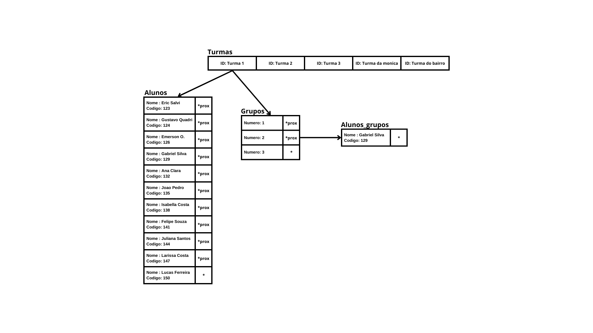

# Estruturas Utilizadas

## Header
Estrutura principal do sistema, contendo:
- `s_qClass`: a quantidade de turmas cadastradas no sistema.
- `turma`: um vetor dinâmico que armazena todas as turmas.

## Turma
Cada turma é representada por:
- `codigo[20]`: o código identificador da turma.
- `alunos`: uma lista encadeada simples com os alunos dessa turma.
- `grupos`: uma lista encadeada simples com os grupos dessa turma.

## Aluno
Cada aluno da turma ou grupo possui:
- `nome[100]`: o nome do aluno.
- `codigo`: um código numérico único para identificar o aluno.
- `prox`: ponteiro para o próximo aluno da lista.

## Grupo
Cada grupo dentro de uma turma possui:
- `numero`: o número identificador do grupo.
- `alunos_grupo`: uma lista encadeada de alunos que pertencem ao grupo.
- `prox`: ponteiro para o próximo grupo da lista.

---

# Organização do Código

- `main.c`: gerencia o menu e fluxo principal do programa.
- `turma.c` e `turma.h`: operações de turma (incluir, listar, remover turmas).
- `aluno.c` e `aluno.h`: operações de alunos (incluir, listar, remover alunos).
- `grupo.c` e `grupo.h`: operações de grupos (incluir aluno no grupo, remover aluno do grupo, consultar alunos de grupos).
- `relatorios.c` e `relatorios.h`: relatórios (listar alunos sem grupo, listar alunos em mais ou menos de uma turma).
- `estruturas.h`: contém todas as estruturas utilizadas (`Header`, `Turma`, `Aluno`, `Grupo`).

---

# Funcionamento das Operações

## main.c

### Início do programa
Na `main` é iniciado o `header`, que é utilizado em todo programa, setado o número de turmas para zero e a referência para a turma como `NULL`.

### `inicioProg()`
Popula todas as informações para utilizar de referências e testes de funcionalidade. Carrega as turmas, os alunos nas turmas e os grupos juntamente com os alunos inseridos.

### `menu()`
Executa todas as opções disponíveis no programa. Se digitado 0, o programa encerra e desaloca a memória da turma.

---

## turma.c e turma.h

### `void listar_turmas(Header h)`
Exibe todas as turmas cadastradas no sistema em ordem e com o seu respectivo código. Se nenhuma estiver cadastrada, exibe mensagem informando.

### `void incluir_nova_turma(Header* h, char novoCodigoExt[20])`
Inclui uma nova turma através do código digitado pelo usuário ou passado como parâmetro. Verifica duplicidade, aloca dinamicamente e inicializa ponteiros.

### `void remover_turma(Header* h)`
Permite remover turmas após validação. Remove alunos da turma e dos grupos, depois os próprios grupos, e realoca as turmas no vetor.

---

## grupo.c e grupo.h

### `void incluir_aluno_no_grupo_de_uma_turma(...)`
Inclui um aluno em um grupo da turma. Verifica duplicidade, cria grupo se necessário e insere o aluno.

### `void remover_aluno_do_grupo(Header *h)`
Solicita turma e grupo, depois o código do aluno. Remove o aluno do grupo e, se necessário, remove o grupo vazio.

### `void consultar_alunos_dos_grupos_de_uma_turma(Header* h, int turmaIndex)`
Mostra os grupos de uma turma e os alunos pertencentes. Solicita índice da turma caso não informado. Exibe mensagem se não houver grupos.

---

## aluno.c e aluno.h

### `void listar_alunos(Header h, int turma)`
Lista alunos da turma indicada, validando existência e percorrendo a lista encadeada.

### `void incluir_novo_aluno(Header* h, int codigoAluno, char nomeAlunoExt[50], int turmaIndexExt)`
Insere novo aluno na turma, buscando a posição `NULL` na lista e preenchendo os dados.

### `void remover_aluno(Header *h)`
Remove aluno da lista da turma e de todos os grupos em que estiver. Libera memória e atualiza as listas.

---

## relatorios.c e relatorios.h

### `void alunos_em_mais_de_uma_turma(Header h)`
Identifica alunos cadastrados em duas ou mais turmas e os lista, se houver. Caso contrário, informa que todos estão em apenas uma turma.

### `void listar_alunos_sem_grupo(Header* h)`
Solicita turma e verifica quais alunos não estão em nenhum grupo, listando-os.

### `void alunos_em_apenas_uma_turma(Header h)`
Percorre todas as turmas e lista os alunos que não estão cadastrados em mais de uma.

---
